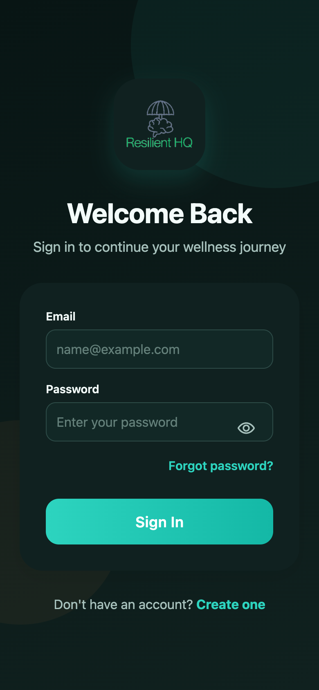
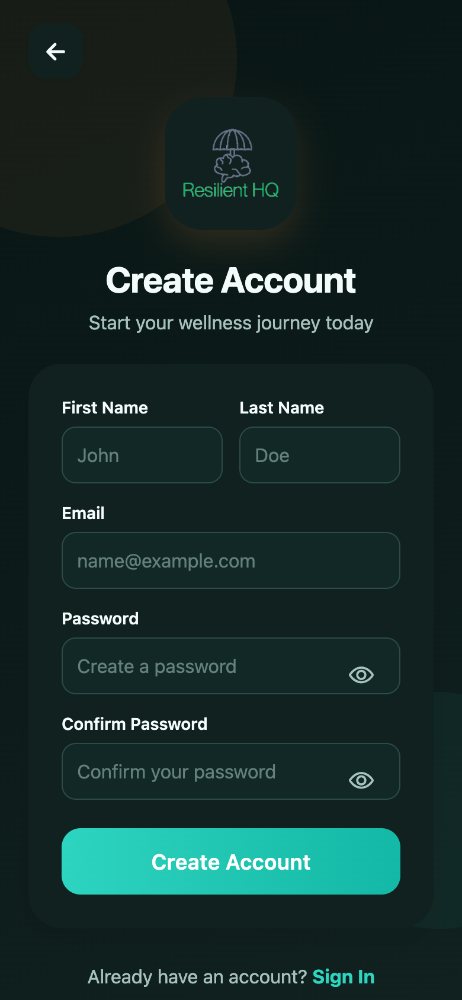
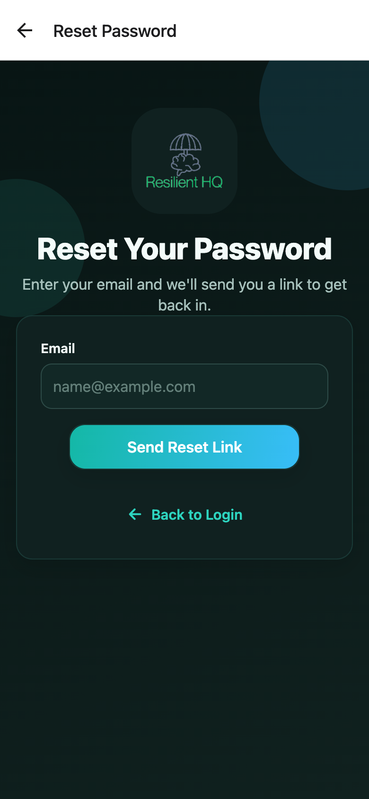
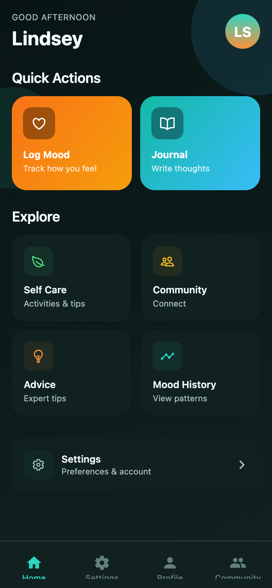
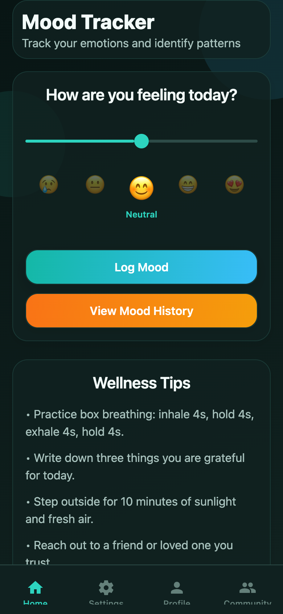
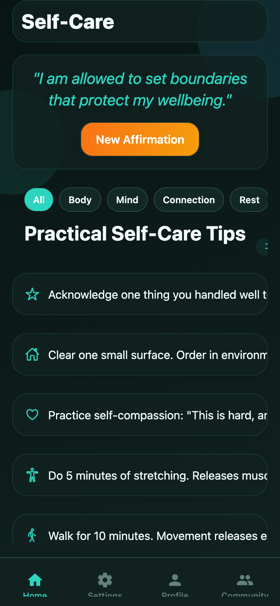
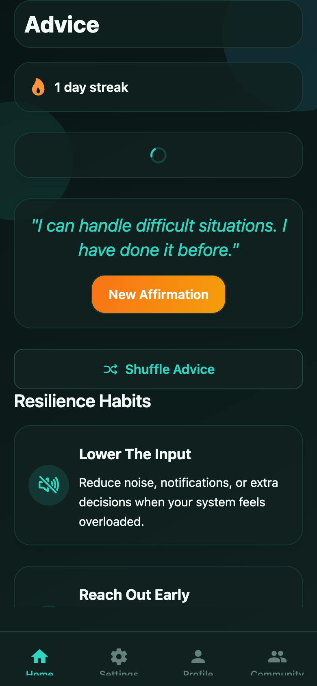
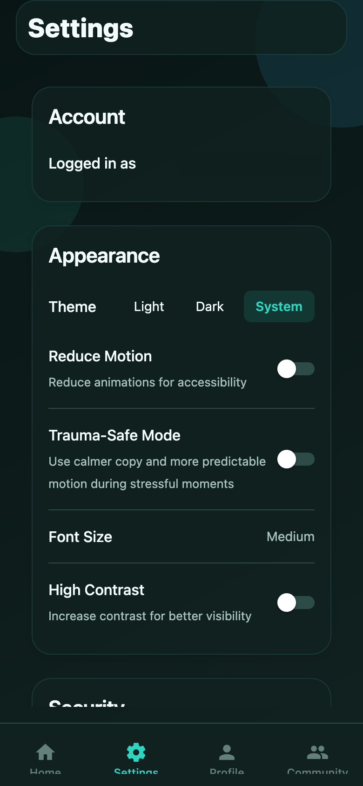
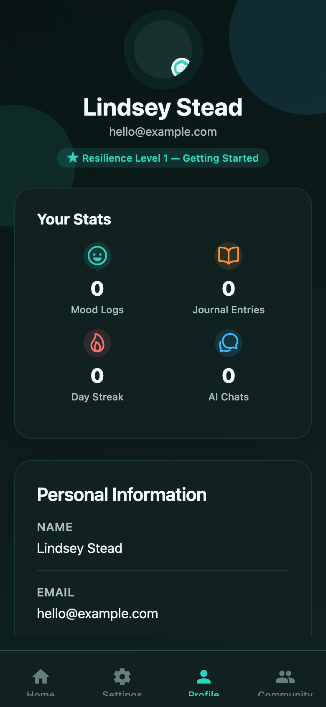

# ResilientHQ

**A trauma-informed, cross-platform resilience app for adults — built with Expo, React Native, and TypeScript.**

[](https://github.com/lindseystead/ResilientHQ/actions/workflows/ci.yml)
[](https://www.typescriptlang.org/)
[](https://reactnative.dev/)
[](https://expo.dev/)
[](https://firebase.google.com/)
[](#testing)
[](./LICENSE)

> ⚠️ ResilientHQ is **not a medical device** and not a substitute for professional or emergency care.
> If you are in crisis, contact your local emergency services (US: call or text **988**). See
> [DISCLAIMER](./DISCLAIMER.md) and [PRIVACY](./PRIVACY.md).

ResilientHQ helps adults build resilience through low-friction daily actions — mood check-ins, trauma-aware journaling, guided reflection, adaptive resilience plans, and moderated peer support. It is a **wellbeing support tool, not a medical device**, and is not a substitute for professional or emergency care.

AI features ship **disabled by default**. Test coverage focuses on validation, safety, and offline logic (see [Testing](#testing)).

---

## Screenshots

Captured on a 390×844 mobile viewport (dark theme). Personal data is masked.

**Onboarding & authentication**

<table>
  <tr>
    <td align="center"><br/><sub><b>Sign In</b></sub></td>
    <td align="center"><br/><sub><b>Create Account</b></sub></td>
    <td align="center"><br/><sub><b>Reset Password</b></sub></td>
  </tr>
</table>

**In the app**

<table>
  <tr>
    <td align="center"><br/><sub><b>Home Dashboard</b></sub></td>
    <td align="center"><br/><sub><b>Mood Tracker</b></sub></td>
    <td align="center"><br/><sub><b>Self-Care</b></sub></td>
  </tr>
  <tr>
    <td align="center"><br/><sub><b>Resilience Advice</b></sub></td>
    <td align="center"><br/><sub><b>Settings &amp; Accessibility</b></sub></td>
    <td align="center"><br/><sub><b>Profile &amp; Stats</b></sub></td>
  </tr>
</table>

---

## Overview

ResilientHQ combines guided reflection, behavior routines, and community support into a single cross-platform app. It is designed to help adults build resilience through low-friction daily actions.

Core user value:

- Daily resilience check-ins for stress, energy, and safety signals.
- Mood tracking + history for pattern awareness without streak pressure.
- Journaling with trauma-aware prompts and reflection workflows.
- Adaptive resilience plans and reminder tone adjustments.
- AI-guided reflection through a first-party proxy with layered safety controls.
- Moderated community features for peer support and resource sharing.
- Offline-safe writes for key wellbeing and community actions with manual force-sync controls.

This is a resilience support product, not a clinical diagnosis system and not a substitute for emergency or licensed care.

---

## Engineering highlights

- **Enforced architecture.** Feature-sliced modules with import boundaries verified in CI (`lint:architecture`), plus import-cycle and design-token guardrails — the structure is checked, not just documented.
- **Safety-first AI.** The client holds no provider secrets; all AI traffic flows through a first-party Node proxy with auth, rate limiting, crisis detection, PII redaction, prompt-injection filtering, and fail-closed moderation. AI features are opt-in via env flags.
- **Offline-first writes.** Mood, journal, post, and comment writes queue on transient failure and replay with deterministic force-sync outcomes; sensitive payloads are indirected through a secure-storage reference.
- **Typed navigation and contracts.** Route params and AI-proxy request/response shapes are fully typed; no inline route strings.
- **Trauma-informed UX and accessibility.** Reduce-motion, high-contrast, adjustable font size, biometric lock, screenshot prevention, and a user-enabled "trauma-safe mode" that softens copy and motion.
- **Verifiable quality gates.** A single `npm run verify` runs formatting, lint, architecture/cycle/design/Firestore governance, dependency and dead-file checks, type-check, tests, and a coverage ratchet — the same gates CI enforces.

---

## Tech Stack

| Layer          | Technology                                                         |
| -------------- | ------------------------------------------------------------------ |
| Mobile app     | Expo SDK 54, React Native 0.81, React 19, TypeScript 5.9           |
| Navigation     | React Navigation 7                                                 |
| Data + auth    | Firebase Auth, Firestore, Firebase Storage                         |
| AI integration | First-party Node AI proxy (`server/ai-proxy/`)                     |
| Testing        | Jest + React Native Testing Library                                |
| Quality gates  | ESLint, Prettier, strict TypeScript, architecture boundary checker |

---

## Project Structure

```text
src/
  config/                 Runtime-safe configuration and design tokens
  domains/                Shared business logic and contracts
    account/
    ai/
    community/
    wellbeing/
  features/               Feature-owned screens, hooks, and UI modules
    advice/
    auth/
    chatbot/
    community/
    help/
    home/
    journal/
    mood/
    profile/
    selfcare/
    settings/
  navigation/             Typed React Navigation stacks and tabs
  providers/              App-wide context providers
  services/               External integrations (feature-agnostic)
  shared/                 Shared UI primitives, utilities, and hooks
  types/                  Shared TypeScript definitions

server/
  ai-proxy.js             Thin runtime entrypoint
  ai-proxy/               First-party AI proxy implementation
    app.js
    auth.js
    config.js
    crisis.js
    http.js
    provider.js
    rateLimit.js
    safety.js
```

Architecture rule summary:

- `features/*` may import from `domains`, `shared`, `services`, `config`, and `types`.
- `features/*` must not import from other `features/*`.
- `shared/*` and `services/*` remain feature-agnostic.
- Cross-feature business logic belongs in `domains/*`.

Enforced by:

```bash
npm run lint:architecture
```

---

## AI Safety And Guardrails

All AI traffic is routed through the first-party proxy. The mobile app does not hold provider secrets.
For open-source safety, AI features are disabled by default and must be explicitly enabled via env flags.

Implemented controls:

- Input checks: crisis language detection, PII redaction, prompt-injection filtering.
- Output checks: unsafe instruction blocking and safe fallback messaging.
- Semantic moderation: optional input/output moderation with fail-closed support.
- Streaming safety: buffered token release with gating and final moderation flush.
- Abuse controls: model allowlist, auth enforcement, rate limiting, CORS allowlist.
- Crisis localization: locale/country-aware escalation messaging and support routing.
- Crisis handling: deterministic (pre-model) crisis-resource surfacing with real 988 / findahelpline routing.
- Disclosure: persistent AI-identity notice and system-prompt self-identification; anti-sycophancy (no reinforcement of harmful beliefs).
- Auditability: structured safety metadata in sync and streaming responses.

The chatbot was reviewed against the leading mental-health chatbot frameworks — **VERA-MH** (suicide-risk evaluation rubric), the APA 2025 chatbot advisory, WHO LMM guidance, OWASP LLM Top 10, and 988 best practices. The [Safety Guardrails audit](./docs/SAFETY_GUARDRAILS_2026.md#mental-health-chatbot-framework-alignment) maps each control to those frameworks and states honestly what is intentionally out of scope for a non-clinical tool (clinical risk-probing, human escalation, minors protections, and a formal VERA-MH evaluation run).

Reference docs:

- [`docs/SAFETY_GUARDRAILS_2026.md`](./docs/SAFETY_GUARDRAILS_2026.md) - controls mapped to VERA-MH, APA, WHO, OWASP LLM, and 988
- [`docs/AI_PROXY_CONTRACT.md`](./docs/AI_PROXY_CONTRACT.md)
- [`DEPLOYMENT_GUIDE.md`](./DEPLOYMENT_GUIDE.md)

---

## Offline Reliability

Implemented reliability controls:

- Write-behind queue for transient failures on mood logs, journal entries, post creation, and comment creation.
- Queue payloads persisted via secure storage references (`payloadRef`) to reduce plain-text local data exposure.
- Queue guardrails: max 250 items, 7-day TTL, 3 retry attempts before removal.
- Typed action routing through `processOfflineQueueItem` with payload validation and user-ownership checks.
- Deterministic force-sync outcomes in settings (`offline`, `up to date`, `deferred`, `partially complete`, `success`).

Reference docs:

- [`docs/OFFLINE_SYNC_CONTRACT.md`](./docs/OFFLINE_SYNC_CONTRACT.md)
- [`docs/ARCHITECTURE.md`](./docs/ARCHITECTURE.md)

---

## Prerequisites

- Node.js 20+ (Expo SDK 54 Metro requires Node 20; see [`.nvmrc`](./.nvmrc))
- npm 9+
- Xcode and/or Android Studio for native runs
- Firebase project (client config + auth)
- Backend base URL for `EXPO_PUBLIC_API_URL`

---

## Quick Start

1. Install dependencies and create local env file:

```bash
npm install
cp .env.example .env
```

2. Populate `.env` with Firebase public config values and `EXPO_PUBLIC_API_URL`.

3. Start the app:

```bash
npm start
```

4. Optional platform targets:

```bash
npm run ios
npm run android
npm run web
```

5. Optional local AI proxy:

```bash
OPENAI_API_KEY=your_key_here npm run server:ai-proxy
```

---

## Environment Configuration

Client runtime (`.env`):

- `EXPO_PUBLIC_FIREBASE_API_KEY`
- `EXPO_PUBLIC_FIREBASE_AUTH_DOMAIN`
- `EXPO_PUBLIC_FIREBASE_PROJECT_ID`
- `EXPO_PUBLIC_FIREBASE_STORAGE_BUCKET`
- `EXPO_PUBLIC_FIREBASE_MESSAGING_SENDER_ID`
- `EXPO_PUBLIC_FIREBASE_APP_ID`
- `EXPO_PUBLIC_API_URL`
- `EXPO_PUBLIC_AI_FEATURES_ENABLED` (default `false`)
- `EXPO_PUBLIC_CHATBOT_ENABLED` (default `false`)
- `EXPO_PUBLIC_JOURNAL_AI_ASSIST_ENABLED` (default `false`)
- `EXPO_PUBLIC_COMMUNITY_AI_ASSIST_ENABLED` (default `false`)
- `EXPO_PUBLIC_PROFILE_AI_BIO_ENABLED` (default `false`)
- `EXPO_PUBLIC_AI_MOOD_SUGGESTIONS_ENABLED` (default `false`)

Server runtime (AI proxy):

- `OPENAI_API_KEY` (required)
- `AI_PROXY_REQUIRE_AUTH`
- `AI_PROXY_VERIFY_FIREBASE_TOKENS`
- `AI_PROXY_PORT`
- `AI_PROXY_ALLOWED_MODELS`
- `AI_PROXY_TIMEOUT_MS`
- `AI_PROXY_ALLOWED_ORIGINS`
- `AI_PROXY_RATE_LIMIT_STORE_PATH`
- `AI_PROXY_ALLOW_INSECURE_AUTH_IN_PRODUCTION` (emergency override; default secure)
- `AI_PROXY_ALLOW_MEMORY_RATE_LIMIT_IN_PRODUCTION` (emergency override; default secure)
- `AI_PROXY_ENABLE_SEMANTIC_MODERATION`
- `AI_PROXY_OUTPUT_MODERATION_MODEL`
- `AI_PROXY_SEMANTIC_MODERATION_FAIL_CLOSED`
- `AI_PROXY_SEMANTIC_MODERATION_MIN_CHARS`
- `AI_PROXY_MAX_MESSAGES`
- `AI_PROXY_MAX_MESSAGE_CHARS`
- `AI_PROXY_MAX_SYSTEM_MESSAGE_CHARS`
- `OPENAI_API_BASE_URL`

Production defaults are fail-closed:

- auth is expected to be enabled (`AI_PROXY_REQUIRE_AUTH=true`)
- Firebase token verification is expected when auth is enabled (`AI_PROXY_VERIFY_FIREBASE_TOKENS=true`)
- distributed rate limiting is expected (`AI_PROXY_RATE_LIMIT_STORE_PATH` configured)

Emergency overrides exist for incident mitigation (`AI_PROXY_ALLOW_INSECURE_AUTH_IN_PRODUCTION`, `AI_PROXY_ALLOW_MEMORY_RATE_LIMIT_IN_PRODUCTION`) and should remain disabled during normal operation.

If `AI_PROXY_VERIFY_FIREBASE_TOKENS=true`, install and configure `firebase-admin` in the server runtime. The proxy fails closed when verification is required but unavailable.

---

## Development Scripts

| Command                     | Purpose                               |
| --------------------------- | ------------------------------------- |
| `npm start`                 | Start Expo dev server                 |
| `npm run start:clear`       | Start Expo with cleared cache         |
| `npm run ios`               | Run iOS build                         |
| `npm run android`           | Run Android build                     |
| `npm run web`               | Run web target                        |
| `npm run server:ai-proxy`   | Start local AI proxy server           |
| `npm run lint`              | Run lint checks                       |
| `npm run lint:fix`          | Auto-fix lint issues where possible   |
| `npm run lint:architecture` | Enforce feature boundary imports      |
| `npm run lint:cycles`       | Detect import cycles in `src`         |
| `npm run lint:design`       | Enforce design-token usage            |
| `npm run lint:firestore`    | Validate Firestore rules/index policy |
| `npm run deps:check`        | Check for newly-unused dependencies   |
| `npm run unused:files`      | Check for newly-unused source files   |
| `npm run type-check`        | TypeScript no-emit check              |
| `npm run format`            | Prettier write                        |
| `npm run format:check`      | Prettier check                        |
| `npm test`                  | Run Jest tests                        |
| `npm run test:coverage`     | Run tests with coverage               |
| `npm run coverage:ratchet`  | Fail if coverage drops below baseline |
| `npm run e2e:maestro:smoke` | Run mobile smoke E2E flow (Maestro)   |
| `npm run verify`            | Run full repo quality gate locally    |

---

## Testing

- **637 tests across 54 suites** (Jest + React Native Testing Library) covering hooks, services, domain logic, the AI proxy, the offline queue, and feature integration flows.
- Coverage is deliberately **concentrated on high-risk logic** rather than spread thin: validation and formatting utilities sit at **85–100%**, while overall line coverage is **~39%**. A coverage ratchet fails CI if coverage regresses below the committed baseline, so the number only moves up.

```bash
npm test              # run the full suite
npm run test:coverage # run with a coverage report
```

---

## Quality Gates

Run these before merge:

```bash
npm run format:check
npm run lint
npm run lint:architecture
npm run lint:cycles
npm run lint:design
npm run lint:firestore
npm run deps:check
npm run unused:files
npm run type-check
npm run test:ci
npm run coverage:ratchet
```

The **CI** workflow (the badge at the top) runs on every push and PR across Node 20 and 22 and enforces the full `verify` gate above, plus:

- secret scanning (`gitleaks`)
- dependency review on pull requests
- production dependency audit (`npm audit --omit=dev --audit-level=critical`)
- Jest coverage thresholds, with stricter bars on guardrail and shared validation/format utilities

Heavier, environment-dependent checks — an Expo configuration audit (`expo-doctor`) and an Android emulator smoke test (Maestro) — run **on demand** via the separate [`Native Checks`](./.github/workflows/native-checks.yml) workflow, so the CI badge reflects the fast, reliable quality gate rather than expensive native builds.

---

## Mobile E2E

Device-level E2E is scaffolded with Maestro and runs via the on-demand `Native Checks` workflow (or locally with `npm run e2e:maestro:smoke`):

- [`e2e/maestro/README.md`](./e2e/maestro/README.md)
- [`e2e/maestro/flows/smoke_auth.yaml`](./e2e/maestro/flows/smoke_auth.yaml)

---

## Documentation Map

- [`docs/README.md`](./docs/README.md) - docs index
- [`DEPLOYMENT_GUIDE.md`](./DEPLOYMENT_GUIDE.md) - production deployment checklist
- [`docs/ARCHITECTURE.md`](./docs/ARCHITECTURE.md) - canonical architecture contract
- [`docs/AI_PROXY_CONTRACT.md`](./docs/AI_PROXY_CONTRACT.md) - API contract + safety metadata
- [`docs/OFFLINE_SYNC_CONTRACT.md`](./docs/OFFLINE_SYNC_CONTRACT.md) - offline queue actions, retry/defer semantics, force sync behavior
- [`docs/REPO_GOVERNANCE.md`](./docs/REPO_GOVERNANCE.md) - branch protection + ownership policy
- [`docs/SAFETY_GUARDRAILS_2026.md`](./docs/SAFETY_GUARDRAILS_2026.md) - controls mapped to VERA-MH, APA, WHO, OWASP LLM, and 988
- [`docs/RESILIENCE_REFACTOR_PLAN.md`](./docs/RESILIENCE_REFACTOR_PLAN.md) - evidence-based roadmap and known limitations
- [`CONTRIBUTING.md`](./CONTRIBUTING.md) - contributor standards
- [`SECURITY.md`](./SECURITY.md) - vulnerability reporting policy

---

## Open Source Standards

Governance and compliance files:

- [LICENSE](./LICENSE)
- [DISCLAIMER.md](./DISCLAIMER.md)
- [PRIVACY.md](./PRIVACY.md)
- [CONTRIBUTING.md](./CONTRIBUTING.md)
- [CODE_OF_CONDUCT.md](./CODE_OF_CONDUCT.md)
- [SECURITY.md](./SECURITY.md)
- [.github/CODEOWNERS](./.github/CODEOWNERS)

---

## License

Released under the [MIT License](./LICENSE).

The software is provided "as is", without warranty of any kind. See [DISCLAIMER.md](./DISCLAIMER.md).
